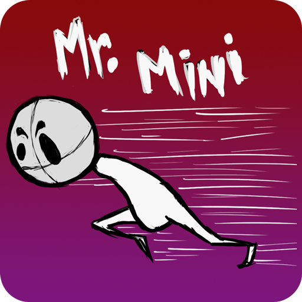

# Mr. Mini - The Game



## Overview

Mr. Mini is a 2D runner game developed using Unity. The game features various animations, textures, and sprites to create an engaging and visually appealing experience. This repository contains all the assets and source files required to build and run the game.

## Project Structure

- `Assets/`: Contains all the game assets including scripts, prefabs, scenes, etc.
- `Library/`: Unity's cache directory. It is automatically generated and should not be included in version control.
- `Temp/`: Temporary files created by Unity. This directory should not be included in version control.
- `Build/`: Contains the build output of the project.
- `Logs/`: Contains log files generated by Unity.
- `ProjectSettings/`: Contains settings for the Unity project.

## Contents

- **00 Synopsis**: Contains the game synopsis document.
- **Animations**: Contains all animation assets including spritesheets, FLA files, and PSD files for player and TV animations.
- **Gameplay**: Contains gameplay-related assets and scripts.
- **Logo**: Contains the logo of the game in PSD format.
- **Objects Sprites**: Contains various sprite assets in different resolutions and raw formats.
- **Project Report**: Contains project documentation including the project report and game design document (GDD).
- **Textures**: Contains texture assets in AI and PSD formats.
- **UnityProject**: Contains the Unity project source files and build files.

## Getting Started

### Prerequisites

- Unity 2020.3 or later
- Adobe Photoshop (for PSD files)
- Adobe Illustrator (for AI files)
- Adobe Animate (for FLA files)

### Installation

1. Clone the repository to your local machine:
   ```sh
   git clone https://github.com/encodedCoder/mr-mini-the-game.git
   ```
2. Open the Unity project located in the `UnityProject/mr. Mini Source/` directory.

### Building the Game

1. Open the Unity project in Unity Editor.
2. Go to `File > Build Settings`.
3. Select the target platform (e.g., Android, iOS, PC).
4. Click on `Build` to generate the build files.

### Running the Game

- For Android builds, install the APK file located in `UnityProject/mr. Mini Builds/Android/` on your Android device.

## Contributing

1. Fork the repository.
2. Create a new branch (`git checkout -b feature-branch`).
3. Make your changes.
4. Commit your changes (`git commit -am 'Add new feature'`).
5. Push to the branch (`git push origin feature-branch`).
6. Create a new Pull Request.

## License

This project is licensed under the MIT License - see the LICENSE file for details.

## Acknowledgements

- Special thanks to the development team and contributors.
- Thanks to the artists for providing the animations and textures.
